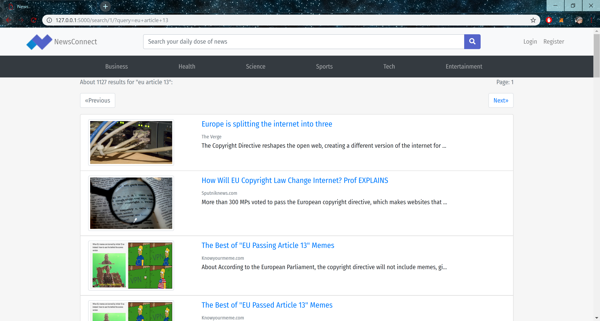
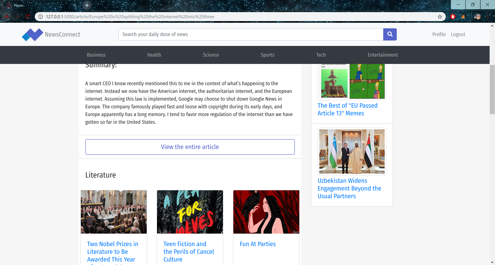
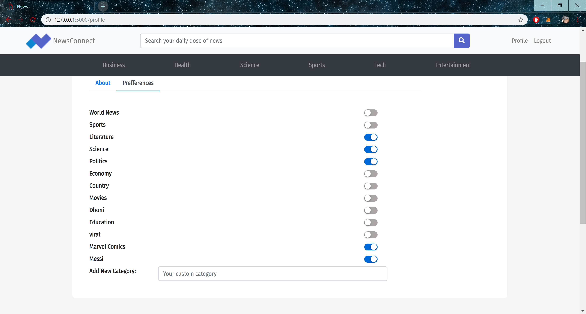
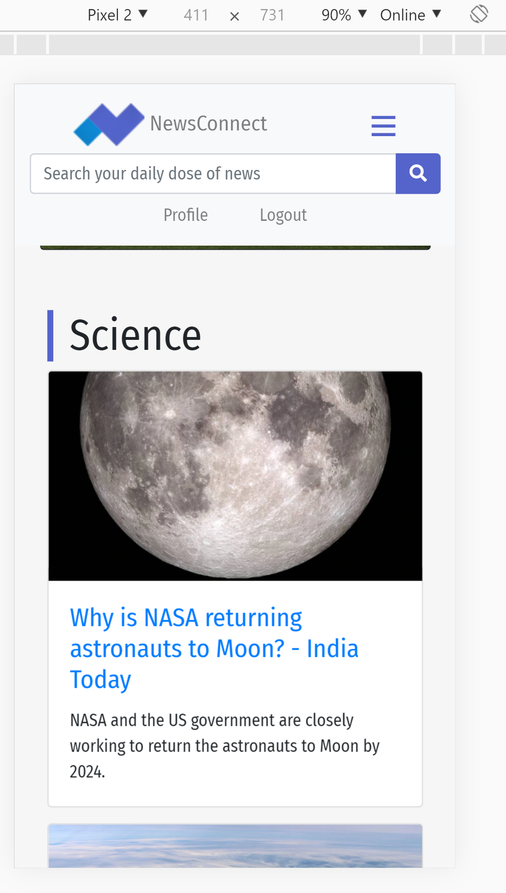
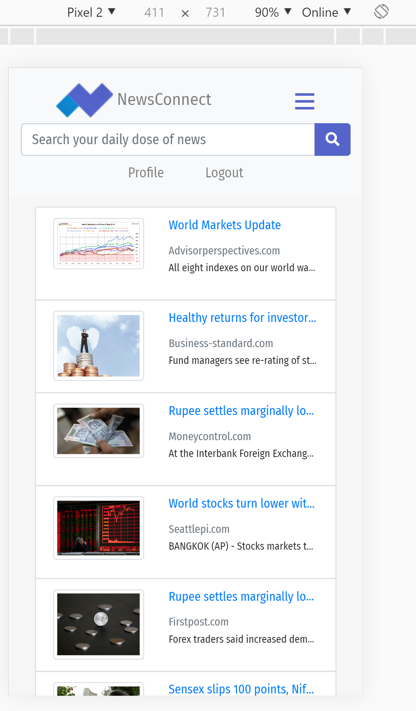

# NewsConnect

One stop shop for all your daily news.

This website helps you to get all your daily news from various different sources at a single place. Using News API we are able to provide news from 30,000 sources and blogs. It has a responsive design and works well on mobile browsers.

### Search
We provide you the ability to search for a desired news topic.

### Article
We give you access to quick summary of the article you want to read so you can go through your articles at a simple glance.

### Recommendations
By selecting your prefferences we provide you with recommendations on it for faster news access.

### Responsive
Responsive design makes the website experience better when viewed from a mobile browser.

## Contributors

* **Pramit Shetty** -  (https://github.com/Pramit356)

See also the list of [contributors](https://github.com/microice1234/NewsConnect/contributors) who participated in this project.
